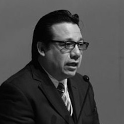

Title: C. Carlos Alberto Arredondo Sibaja
Slug: carlos-alberto-arredondo-sibaja
Summary: C. Carlos Alberto Arredondo Sibaja.
Date: 2019-08-08 10:02
Modified: 2019-08-08 10:02

**Institución que lo propone:** Universidad Autónoma de Coahuila.

**Lugar de Residencia:** Saltillo, Coahuila de Zaragoza.

**Formación Académica:**

* Maestría en Derecho, con acentuación en Derechos Humanos, por la Universidad Autónoma de Coahuila. (En curso)
* Licenciatura en Derecho, por la Universidad del Valle de México.
* Maestría en Administración y Alta Dirección, por la Universidad Iberoamericana campus Torreón.
* Ingeniería Industrial y de Sistemas, por la Universidad Autónoma de Coahuila.

**Antecedentes Laborales:**

* Coordinador de Proyectos en el periódico Vanguardia.
* Director del Centro de Educación Jurídica de la Academia Interamericana de Derechos Humanos, UAdeC.
* Secretario Académico de la Facultad de Jurisprudencia de la U.A de C.
* Consejero Electoral en el Instituto Electoral y de Participación Ciudadana de Coahuila.
* Coordinador de Asesores de la oficina de la Consejera Lourdes López Flores en el Instituto Federal Electoral.
* Asesor Parlamentario del Congreso del Estado de Coahuila.
* Síndico del Ayuntamiento de Acuña Coahuila.
* Columnista y Miembro del Consejo Editorial del periódico Vanguardia.
* Editorialista en los noticiarios radiofónicos de Jaubert Tafich Organización.
* Corresponsal de la agencia de noticias Notimex en Acuña, Coahuila.
* Director de noticias en la estación radiofónica XHPL FM en Acuña, Coahuila.

**Otras actividades relevantes:**

Colaboró, de 2016 a 2018, en la elaboración del Informe Anual de la Relatoría Especial para la Libertad de Expresión de la Comisión Interamericana de Derechos Humanos.

Como Asesor de la Consejera Lourdes López Flores en el Instituto Federal
Electoral, participó en los trabajos del Comité de Adquisiciones,
Arrendamientos y Servicios del Instituto, así como en la realización de los trabajos de la Comisión de Contraloría Interna del IFE, realizando tareas de supervisión y vigilancia en la adquisición de bienes.

Impartió la materia de Buen Gobierno en la especialidad de Gobierno Abierto, Transparencia y Rendición de Cuentas en la Facultad de Jurisprudencia de la U.A. de C.

Colaboró en la incorporación del contenido temático de la materia Cultura a la Legalidad, en el Plan de Estudios de la Licenciatura en Derecho en la Facultad de Jurisprudencia de la UAdeC. También impartió dicha materia.

Como Consejero del Instituto Electoral y de Participación Ciudadana de Coahuila, formó parte de las Comisiones de Administración y Servicio Profesional, de Lista Nominal y Participación Ciudadana, de Organización y Capacitación Electoral, de Acceso de los Partidos Políticos a Radio y Televisión, de Comunicación Social, y de Votación Electrónica.

